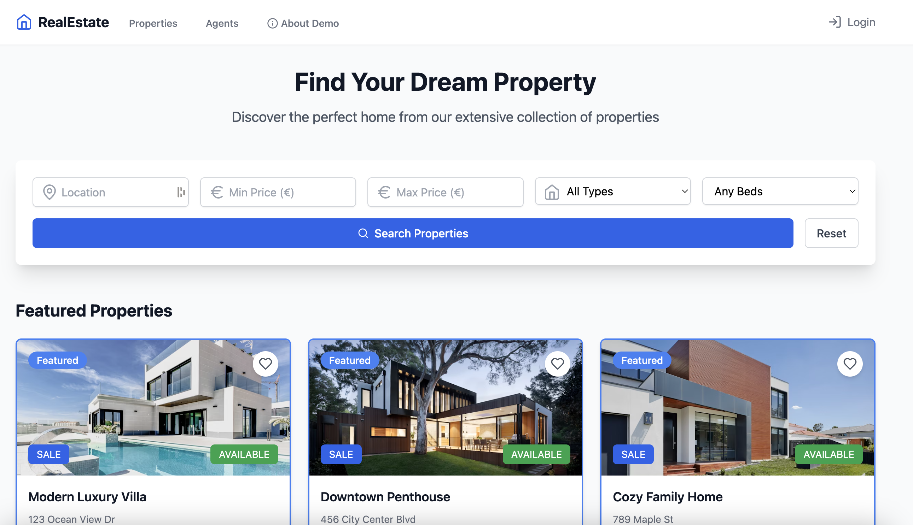

# Real Estate Platform Demo

A real estate platform built with React, TypeScript, and Express. The project is a deliberately self-contained challenge target so QA Engineers can practise **both web UI and HTTP API** automation against the same application.



## 🚀 Getting Started

### Prerequisites
- Node.js 18 or higher
- npm or yarn

### Installation

1. Clone the repository
```bash
git clone https://github.com/Aviv-public/aviv-qa-technical-test.git
cd aviv-qa-technical-test
```

2. Install dependencies
```bash
npm install
```

3. Start the web app **and** the API (single command, runs concurrently)
```bash
npm run dev
```

This starts:

| Service | URL |
|---|---|
| Web app (Vite) | http://localhost:5173 |
| REST API (Express) | http://localhost:3001 |
| Interactive API docs (Swagger UI) | http://localhost:3001/api/docs |
| OpenAPI 3 spec (JSON) | http://localhost:3001/api/openapi.json |

Vite proxies `/api/*` to the Express server, so calls from the SPA hit the same origin in dev.

You can also run pieces separately:
```bash
npm run dev:web     # vite only
npm run dev:api     # express only (tsx watch)
npm run start:api   # express without watch (for CI/test runs)
```

## 🔐 Test accounts (seeded)

All three accounts share password **`Test123!`**.

| Email | Role |
|---|---|
| `test@example.com` | user |
| `agent@example.com` | agent |
| `admin@example.com` | admin |

## 🔌 REST API

- Base URL: `http://localhost:3001/api`
- Auth: `Authorization: Bearer <jwt>` (issued by `POST /api/auth/login` or `/auth/register`)
- Token lifetime: 24h, HS256
- Persistence: LowDB JSON file at `server/data/db.json` (gitignored; recreated from seed on first boot)
- Full contract: see Swagger UI at `/api/docs`

Key endpoints — see the OpenAPI spec for full request/response shapes:

| Method | Path | Notes |
|---|---|---|
| POST | `/api/auth/login` | returns `{user, token}` |
| POST | `/api/auth/register` | role `user` or `agent` (admin only via seed) |
| GET | `/api/auth/me` | current user (auth) |
| GET | `/api/properties` | filters: `type`, `status`, `minPrice`, `maxPrice`, `bedrooms`, `bathrooms`, `location`, `q`, `sort` |
| GET/POST/PUT/DELETE | `/api/properties/:id` | POST = agent/admin; PUT/DELETE = owner or admin |
| GET | `/api/agents`, `/api/agents/:id` | public |
| POST | `/api/agents/:agentId/messages` | contact form (auth optional) |
| GET | `/api/users` | admin only |
| PUT/DELETE | `/api/users/:id` | admin only |
| PUT | `/api/users/me` | profile + password change (auth) |
| GET/POST/DELETE | `/api/users/me/wishlist[/:propertyId]` | auth |
| POST | `/api/test/reset` | **non-production only** — restore DB to seed |

### Resetting state between test runs

```bash
curl -X POST http://localhost:3001/api/test/reset
```

This rewrites `server/data/db.json` from the seed. The route returns 404 when `NODE_ENV=production`.

### Configuration (environment variables)

| Var | Default | Purpose |
|---|---|---|
| `PORT` | `3001` | API port |
| `JWT_SECRET` | `dev-secret-change-me` | HS256 key |
| `JWT_EXPIRES_IN` | `24h` | Token TTL |
| `DB_PATH` | `server/data/db.json` | LowDB file |
| `SEED_ON_BOOT` | `false` | Force re-seed on startup |
| `SEED_PASSWORD` | `Test123!` | Password hashed into seeded accounts |
| `WEB_ORIGIN` | `http://localhost:5173` | CORS allowlist |
| `NODE_ENV` | `development` | `production` disables `/api/test/reset` |

## ✅ Built-in unit tests

The repo ships with **60 unit tests** covering the API's pure functions and shared validation — they serve as both a smoke check and an executable spec for candidates.

```bash
npm test          # one-shot
npm run test:watch
```

What's covered:

| File | Subject |
|---|---|
| `server/src/services/properties.service.test.ts` | Property filtering + sorting (type, status, price range, bedrooms, location, free-text `q`, all sort modes, AND-composition, no mutation) |
| `server/src/services/auth.service.test.ts` | bcrypt hash/compare (incl. salt non-determinism), JWT sign/verify, `toPublicUser` strips `passwordHash` |
| `server/src/schemas.test.ts` | Zod request schemas: login, register (password complexity table), property create + numeric coercion, query coercion, update-me cross-field rule, contact form |
| `src/utils/format.test.ts` | `formatCurrency` (EUR, no decimals, zero, negative) |
| `src/utils/validation.test.ts` | Frontend `loginSchema` / `registerSchema` (confirmPassword refinement, password complexity, role enum) |

These are **not** the candidate's deliverable — they protect the system-under-test from regressions. Candidates write their own e2e / API automation on top.

## 🧪 Submitting Tests

QA Engineers, responsible for ensuring the quality and functionality of the API, should follow test automation best practices including:

#### Page Object Pattern
- Implement Page Object Model (POM) to create an object repository for web UI elements
- Each page should have its corresponding page class
- Maintain separation between test methods and page specific code
- Group related elements and actions within relevant page objects

#### Data-Driven Testing
- Externalize test data in JSON/YAML files
- Parameterize tests to run with multiple data sets
- Maintain test data separate from test logic
- Include both positive and negative test scenarios

#### Test scenarios that need to be implemented
- Implement test cases for user registration, login, and logout
- Test user roles and permissions (Admin, Agent, User)
- Verify user profile management functionality
- Test property listing and search functionality
- Validate property details and booking process
- Verify user notifications and alerts


#### Coverage Requirements
- Minimum 80% test coverage for critical paths
- Test all user roles (Admin, Agent, User)

#### Technical Stack
- Test Automation Frameworks:
    - Choose one of the following:
        - Selenium WebDriver (Java/Python/JavaScript)
        - WebDriver.IO (JavaScript/TypeScript)
        - Cypress (JavaScript/TypeScript)
        - Playwright (JavaScript/TypeScript)
- Continuous Integration:
    - GitHub Actions for automated test execution
    - Parallel test execution
    - Scheduled test runs
- Test Reporting:
    - Allure Reports integration
    - Detailed test execution results
    - Screenshots and video captures

### Contribution Steps
1. **Fork the repository:**
    Go to the repository on GitHub and click the "Fork" button to create a copy of the repository in your own GitHub account.

2. **Clone your forked repository:**
    ```bash
    git clone https://github.com/username/aviv-qa-technical-test.git
    cd aviv-qa-technical-test
    ```

3. **Create a new branch:**
    ```bash
    git checkout -b test-branch-name
    ```

4. **Add your test cases:**
    Add your test cases in the `tests` directory.

5. **Commit your changes:**
    ```bash
    git add .
    git commit -m "Add test cases"
    ```

6. **Create a GitHub Actions workflow:**
    In the root of your repository, create a directory named `.github/workflows` if it doesn't already exist. Inside this directory, create a file named `ci.yml`.

7. **Push your branch:**
    ```bash
    git push origin test-branch-name
    ```

8. **Create a pull request:**
    Go to the repository on GitHub and create a pull request to merge your test branch into the main branch.

## 📄 License

This project is MIT licensed.
